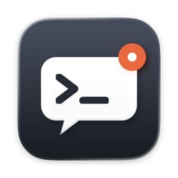
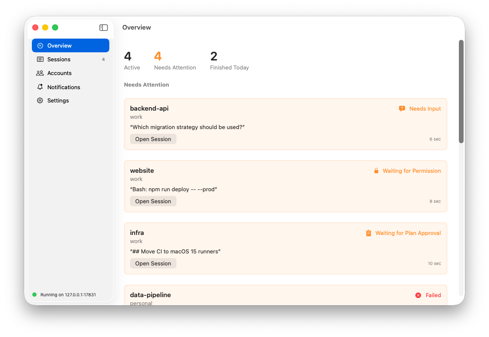
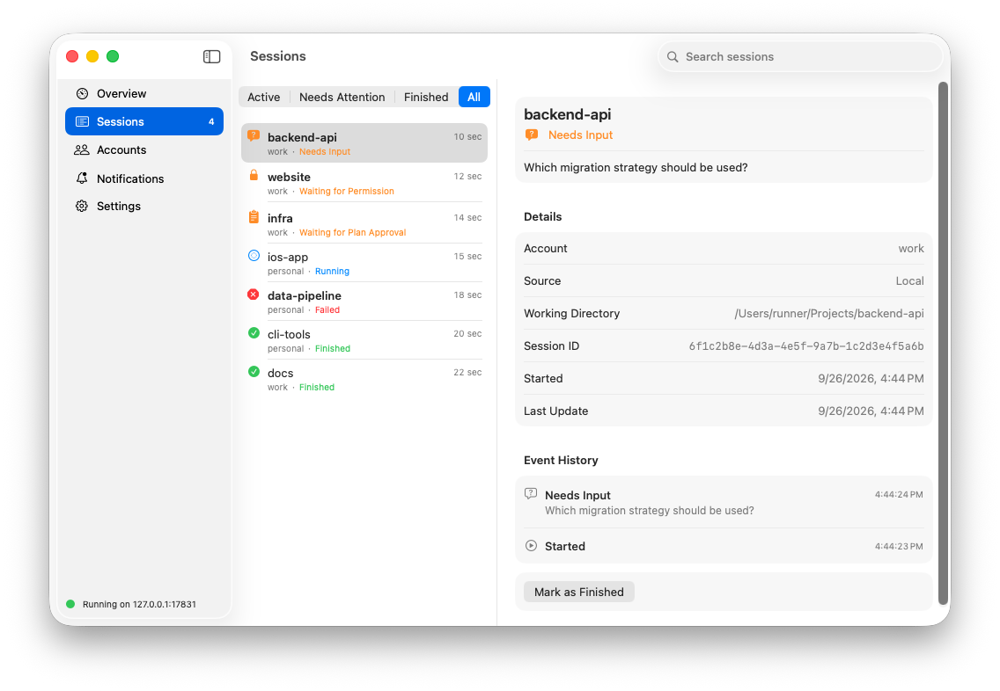
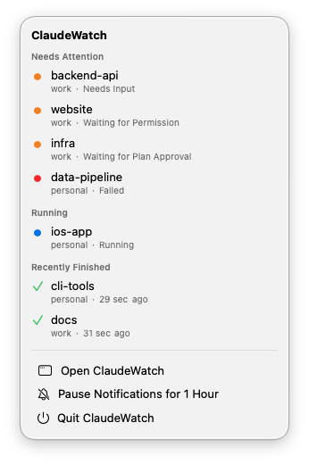
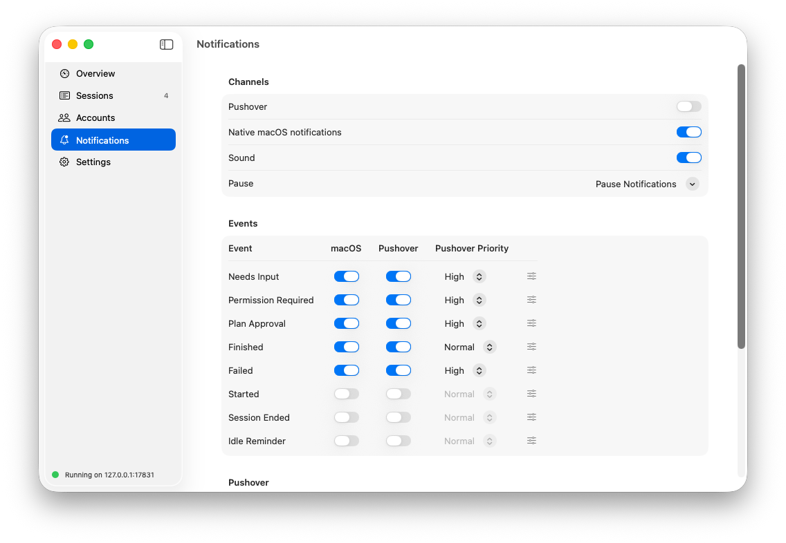
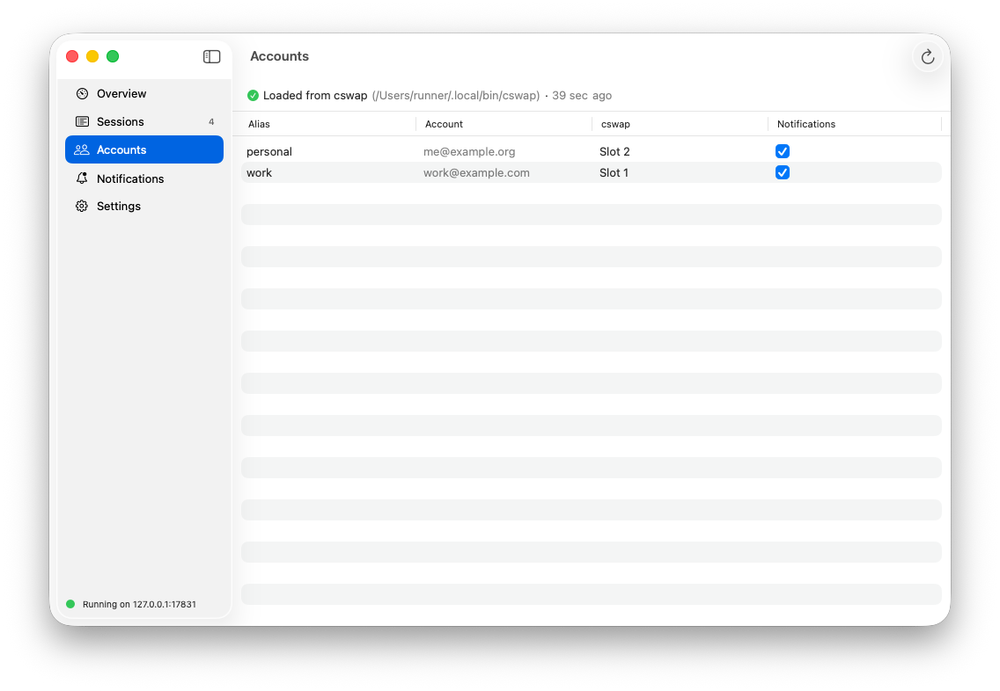
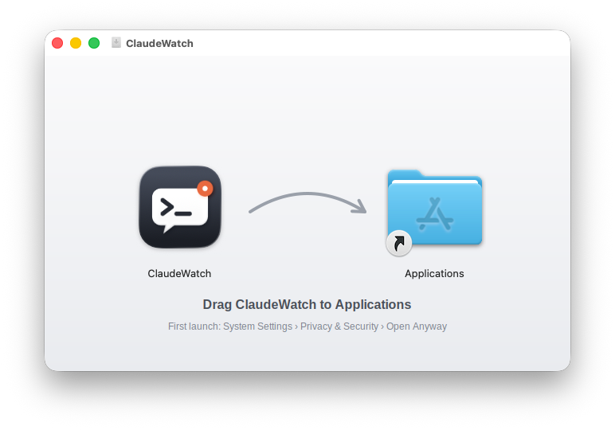

<p align="center">
  
</p>

<h1 align="center">ClaudeWatch</h1>

A native macOS app that watches your Claude Code sessions and tells you, on your Mac
and through Pushover on your phone, when a session needs input, needs permission,
waits for plan approval, finishes, or fails. It works the same whichever Claude
account is active, including accounts switched with
[`cswap`](https://github.com/realiti4/claude-swap).

- Main window (Overview, Sessions, Accounts, Notifications, Settings) plus a `MenuBarExtra`
- Local hook listener on `127.0.0.1:17831`
- SwiftData history, per-event notification rules, pause, retention
- Pushover credentials in the Keychain. Claude credentials are never read or stored.
- No third-party dependencies

<p align="center">
  
</p>

## Screenshots

| Sessions | Menu bar |
|---|---|
|  |  |

| Notification rules | Accounts from cswap |
|---|---|
|  |  |

<p align="center">
  
</p>

The screenshots come from `.github/workflows/readme-images.yml`, which runs the real app
on a CI Mac and fills it with demo sessions through the hook listener
(`Scripts/seed-demo-sessions.py`).

## About

The product specification is in [`SPEC.md`](SPEC.md). Implementation notes and deviations
from it are in [`docs/IMPLEMENTATION_PLAN.md`](docs/IMPLEMENTATION_PLAN.md). The architecture,
including the proposed cloud relay, is in [`docs/ARCHITECTURE.md`](docs/ARCHITECTURE.md).

## Requirements

- macOS 14 Sonoma or newer
- Xcode 26 or newer (needed for the Icon Composer app icon)
- Claude Code with hooks (verified with 2.1.283)
- Optional: `cswap` (claude-swap ≥ 0.26, JSON schema 1) for account names
- Optional: a Pushover account and application token

## Install

Download `ClaudeWatch-<version>.dmg` from the
[Releases](https://github.com/MagicalWig34653/ClaudeWatch/releases) page, open it and
drag ClaudeWatch to Applications. A `.sha256` checksum is attached next to each DMG.

Release builds are universal (Apple silicon and Intel) and ad-hoc signed, not notarized.
macOS will therefore refuse the first launch. Open it once by either:

- trying to open ClaudeWatch, then choosing **System Settings › Privacy & Security ›
  Open Anyway**, or
- running `xattr -dr com.apple.quarantine /Applications/ClaudeWatch.app`.

Because every build has a different ad-hoc signature, macOS may ask again for Keychain
access to the Pushover credentials after an update.

## Build and run

```sh
open ClaudeWatch.xcodeproj          # then Run the "ClaudeWatch" scheme
# or
xcodebuild -project ClaudeWatch.xcodeproj -scheme ClaudeWatch -configuration Release build
```

The project signs ad hoc ("Sign to Run Locally"). To distribute, pick your team under
Signing & Capabilities. Hardened Runtime is already on for Release builds.

**App icon:** `ClaudeWatch/AppIcon.icon` is an Icon Composer document: a gradient
background plus three layers (glass speech bubble, prompt, badge). Open it in Icon Composer,
which ships with Xcode 26, to adjust the Liquid Glass look. Building requires
Xcode 26; it generates the classic `.icns` for macOS 14 and 15.

**Releases:** publishing a GitHub release (tag `vX.Y.Z`) runs
`.github/workflows/release.yml`. It tests the app, builds a universal Release app with
`MARKETING_VERSION` taken from the tag, packages `ClaudeWatch-X.Y.Z.dmg` with `hdiutil`,
and attaches the DMG and its SHA-256 checksum to the release. You can also run the workflow manually (Actions › Release DMG › Run workflow):

- with no tag, it only builds the DMG as a workflow artifact;
- with the tag of an existing release, it rebuilds the DMG and re-attaches it;
- with a new tag and **create_release** checked, it builds the selected branch first and
  only then creates and publishes the release on that commit, with notes and the DMG
  attached. Releases created this way don't trigger a second run.

Tests:

```sh
swift test --package-path ClaudeWatchCore      # core pipeline; runs on macOS and Linux
xcodebuild test -project ClaudeWatch.xcodeproj -scheme ClaudeWatch -destination 'platform=macOS'
```

## Connect Claude Code

ClaudeWatch never edits your Claude Code configuration. You add the hooks yourself:

1. **Install the forwarding script**

   ```sh
   mkdir -p ~/.claude/hooks
   cp Integration/claude-watch-hook.sh ~/.claude/hooks/
   chmod +x ~/.claude/hooks/claude-watch-hook.sh
   ```

   The script POSTs its stdin to `http://127.0.0.1:17831/v1/events` with a 2-second
   timeout. It prints nothing and always exits 0, so Claude Code is never blocked or
   changed, even when ClaudeWatch isn't running. It needs only `/bin/sh` and `curl`.

2. **Merge the hooks into `~/.claude/settings.json`** (every project) or a project's
   `.claude/settings.json`. If the file already has a `"hooks"` object, add these
   entries to it rather than replacing it. The same snippet is in
   [`Integration/claude-settings.example.json`](Integration/claude-settings.example.json),
   and Settings › Claude Code Hooks has a copy button.

   ```json
   {
     "hooks": {
       "SessionStart":      [{ "hooks": [{ "type": "command", "command": "~/.claude/hooks/claude-watch-hook.sh", "timeout": 5 }] }],
       "UserPromptSubmit":  [{ "hooks": [{ "type": "command", "command": "~/.claude/hooks/claude-watch-hook.sh", "timeout": 5 }] }],
       "PreToolUse":        [{ "matcher": "AskUserQuestion|ExitPlanMode", "hooks": [{ "type": "command", "command": "~/.claude/hooks/claude-watch-hook.sh", "timeout": 5 }] }],
       "PermissionRequest": [{ "matcher": "*", "hooks": [{ "type": "command", "command": "~/.claude/hooks/claude-watch-hook.sh", "timeout": 5 }] }],
       "PostToolUse":       [{ "matcher": "*", "hooks": [{ "type": "command", "command": "~/.claude/hooks/claude-watch-hook.sh", "timeout": 5 }] }],
       "Notification":      [{ "hooks": [{ "type": "command", "command": "~/.claude/hooks/claude-watch-hook.sh", "timeout": 5 }] }],
       "Stop":              [{ "hooks": [{ "type": "command", "command": "~/.claude/hooks/claude-watch-hook.sh", "timeout": 5 }] }],
       "StopFailure":       [{ "hooks": [{ "type": "command", "command": "~/.claude/hooks/claude-watch-hook.sh", "timeout": 5 }] }],
       "SessionEnd":        [{ "hooks": [{ "type": "command", "command": "~/.claude/hooks/claude-watch-hook.sh", "timeout": 5 }] }]
     }
   }
   ```

   What each hook is for:

   | Hook | ClaudeWatch event |
   |---|---|
   | `PreToolUse` on `AskUserQuestion` | **Needs input**, with the question text |
   | `PreToolUse` on `ExitPlanMode` | **Plan approval required** |
   | `PermissionRequest` | **Permission required**, e.g. `Bash: rm -rf build` (`AskUserQuestion` / `ExitPlanMode` map as above) |
   | `Stop` | **Finished**, with Claude's last message |
   | `StopFailure` | **Failed** (rate limit, auth, server error, …) |
   | `Notification` | Backup signal for permission/input prompts, plus the idle reminder. Never produces a second notification for a state a specific hook already reported. |
   | `SessionStart`, `UserPromptSubmit`, `PostToolUse` | Activity. Moves a session back to *running* after you answer or approve. |
   | `SessionEnd` | Session ended |

   `PostToolUse` with `"*"` keeps the running/waiting state accurate after you approve
   a permission. It costs one local HTTP request per tool call. You can drop it; sessions
   will then show their last attention state until the turn finishes.

3. **Restart Claude Code sessions** (or run `/hooks` to review them), then click
   **Send Test Event** in Settings or the Overview. The test goes through the real
   listener and pipeline.

**Custom port:** if you change the port in Settings, set it for the script too:
`"command": "CLAUDE_WATCH_PORT=18000 ~/.claude/hooks/claude-watch-hook.sh"`.

**Alternative without a script:** Claude Code also supports HTTP hooks, which post the same
JSON directly: `{ "type": "http", "url": "http://127.0.0.1:17831/v1/events", "timeout": 5 }`.
The command script is recommended because it fails silently and fast when ClaudeWatch
is not running.

### Posting fixtures during development

```sh
Integration/post-fixture.sh                                       # list fixtures
Integration/post-fixture.sh pre-tool-use-ask-user-question
Integration/post-fixture.sh permission-request-bash my-session-id
```

## Accounts (`cswap`)

ClaudeWatch reads `cswap list --json` and `cswap status --json` (metadata only: slot,
email, alias). It never touches credentials. To attribute events to accounts it:

1. recognizes `cswap run` sessions from the transcript path
   (`~/.claude-swap-backup/sessions/<slot>-…/`), and otherwise
2. uses the account `cswap` reports as active.

If `cswap` is missing, everything still works and events show "Unknown Account".
`cswap` is looked up in `~/.local/bin`, `/opt/homebrew/bin`, `/usr/local/bin`, `~/bin`,
`/opt/local/bin`, then via your login shell (`$SHELL -l -c 'command -v cswap'`). You can
set an explicit path in Settings. You can mute notifications per account in Accounts.

## Pushover

In Notifications › Pushover, enter your **User Key** and an **Application Token**
(create an application at pushover.net), click **Save**, then **Send Test Notification**.
Both values go only to the macOS Keychain. They are never written to SwiftData,
UserDefaults or logs. Errors from Pushover are shown in human-readable form without the secrets.

## Security notes

- The listener binds to `127.0.0.1` only, accepts only `POST /v1/events` with
  `Content-Type: application/json` and a `Content-Length` of at most 2 MiB (headers 16 KiB),
  rejects requests that carry an `Origin` header (browsers), and times out after 10 s.
- Payload content is treated as untrusted text: control and bidi-override characters are
  stripped, previews are truncated, and the UI renders it verbatim, never as Markdown.
- Payloads never cause command execution. The only processes ClaudeWatch starts are
  `cswap` (with fixed argument arrays) and, for discovery, your login shell with the constant
  command `command -v cswap`.
- Prompt text and tool results from hooks are not decoded or stored.
- Any local process can post events to the listener. That is the same trust level as the
  hook itself. Events can create notifications, but they cannot do anything else.

## Troubleshooting

- **"Port 17831 is already in use"**: another app, or a second ClaudeWatch, holds the port.
  Change it in Settings, then update `CLAUDE_WATCH_PORT` in the hook command.
- **No macOS notifications**: check Notifications › macOS Notifications. If permission was
  denied, ClaudeWatch does not ask again. Use "Open System Settings…".
- **Logs**: `log stream --predicate 'subsystem == "com.claudewatch.ClaudeWatch"'`
  (categories: listener, events, sessions, pushover, notifications, cswap, persistence).
  Message contents are never logged at default levels.
- **Data location**: `~/Library/Application Support/ClaudeWatch/ClaudeWatch.store`.
